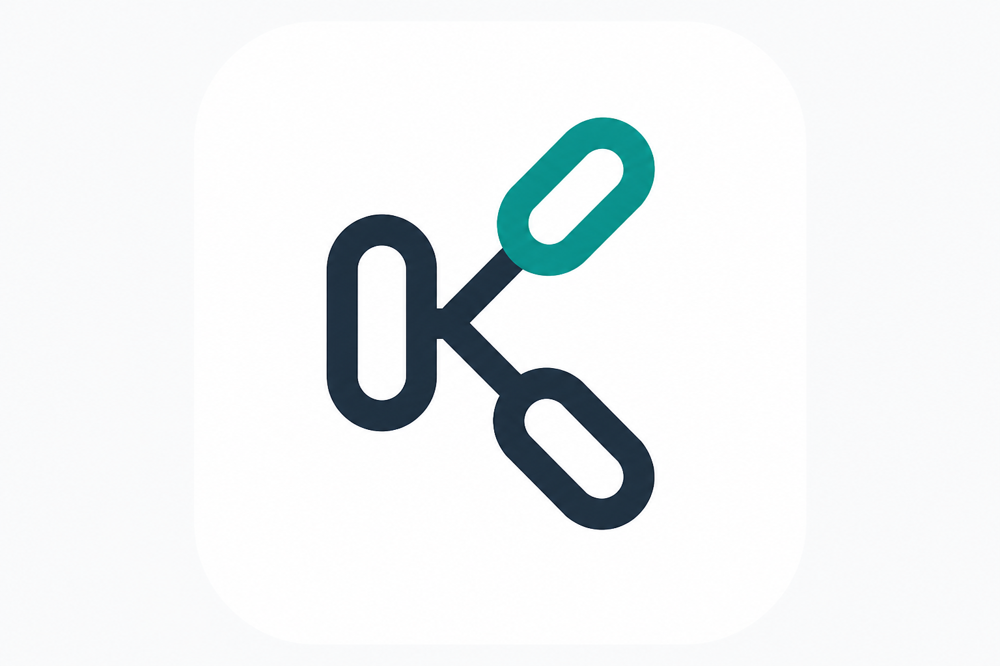

<p align="center">
  
</p>

<h1 align="center">langchain-keeperhub</h1>

<p align="center">
  <strong>Give your LangChain agent the ability to send tokens, call smart contracts, and resolve ENS names — without ever touching a private key.</strong>
</p>

<p align="center">
  <a href="https://pypi.org/project/langchain-keeperhub/"></a>

</p>

---

`langchain-keeperhub` is a Python SDK that connects LangChain / LangGraph agents to [KeeperHub](https://keeperhub.com), a Web3 execution service. You provide an API key; KeeperHub handles wallet management and transaction signing inside a secure enclave ([Turnkey TEE](https://turnkey.com)). Your code never sees the private key.

> Originally built for [ETHGlobal OpenAgents](https://ethglobal.com/events/openagents).

> **Independent community project** by [@devendra116](https://github.com/devendra116). Not affiliated with or endorsed by KeeperHub.

## What can it do?

| Capability | How |
|---|---|
| **Send tokens** (ETH, USDC, any ERC-20) | `transfer_funds` tool |
| **Read/write smart contracts** | `contract_call` tool |
| **Conditional execution** ("send only if balance > X") | `check_and_execute` tool |
| **Resolve ENS names** (vitalik.eth → 0x...) | `resolve_ens` / `reverse_resolve_ens` tools |
| **Track transaction history** | Built-in SQLite store |
| **Manage KeeperHub workflows** | Optional MCP bridge |

Your agent gets these as LangChain tools. It decides when and how to use them based on the user's request.

## Install

```bash
pip install langchain-keeperhub
```

Optional extras:

```bash
pip install "langchain-keeperhub[workflows]"  # MCP workflow tools
pip install "langchain-keeperhub[ens]"         # keccak fallback (if OpenSSL lacks it)
```

## Quick start

**1. Get a KeeperHub API key** at [app.keeperhub.com](https://app.keeperhub.com) (starts with `kh_`).

**2. Install dependencies:**

```bash
pip install langchain-keeperhub langchain langchain-google-genai langgraph python-dotenv
```

**3. Write your agent:**

```python
from dotenv import load_dotenv
from langchain.agents import create_agent
from langchain_google_genai import ChatGoogleGenerativeAI
from langchain_keeperhub import KeeperHubToolkit

load_dotenv()  # reads KEEPERHUB_API_KEY and GOOGLE_API_KEY from .env

toolkit = KeeperHubToolkit()  # or pass api_key="kh_..." directly
agent = create_agent(
    model=ChatGoogleGenerativeAI(model="gemini-2.5-flash", temperature=0),
    tools=toolkit.get_tools(),
)

result = agent.invoke({"messages": [("user", "Send 1 USDC on Base Sepolia to 0x...")]})
print(result["messages"][-1].content)
```

Any LangChain-compatible model works (OpenAI, Anthropic, etc.) — the examples just happen to use Gemini.

## Tools reference

| Tool | What it does |
|------|-------------|
| `transfer_funds` | Send native tokens or ERC-20s. Returns an `execution_id`. |
| `contract_call` | Read from or write to any verified smart contract. |
| `check_and_execute` | Read a value, check a condition, then execute only if it passes. |
| `get_execution_status` | Poll a write's status by `execution_id` until it completes. |
| `list_chains` | List all chains KeeperHub supports. |
| `fetch_contract_abi` | Fetch a contract's ABI by chain and address. |
| `get_wallet_address` | Get the wallet address tied to your API key. |
| `resolve_ens` | ENS/Basenames forward lookup (name → address). Uses public RPC, no KeeperHub API. |
| `reverse_resolve_ens` | ENS/Basenames reverse lookup (address → name). |
| `list_execution_history` | Query past writes (requires `history=True`). |

After any write tool (`transfer_funds`, `contract_call`, `check_and_execute`), always call `get_execution_status` with the returned `execution_id` to get the final transaction hash.

## Safety options

```python
toolkit = KeeperHubToolkit(
    api_key="kh_...",
    testnet_only=True,                       # block writes to mainnet chains
    allowed_chain_ids={"11155111", "84532"},  # only Sepolia + Base Sepolia
    history=True,                             # log every write to SQLite
)
```

## Use without an LLM

You can also use `KeeperHubClient` directly for scripting — no agent needed:

```python
import asyncio
from langchain_keeperhub import KeeperHubClient

async def main():
    async with KeeperHubClient() as client:
        chains = await client.list_chains()
        print(chains)

asyncio.run(main())
```

## Environment variables

| Variable | Required | Purpose |
|---|---|---|
| `KEEPERHUB_API_KEY` | Yes | Your KeeperHub API key (`kh_` prefix) from [app.keeperhub.com](https://app.keeperhub.com) |
| `GOOGLE_API_KEY` | Only for examples | Needed by `langchain-google-genai` for Gemini |

## Compatibility

- **Python** 3.10+
- **v0.4+** requires `langchain-core` 1.x. If you're on `langchain-core` 0.3.x, use `langchain-keeperhub` 0.3.x.

## Development

```bash
git clone https://github.com/devendra116/langchain_keeperhub.git
cd langchain_keeperhub
pip install -e ".[dev]"
pytest
```

## Docs

- [Getting Started](docs/getting-started.md) — install, configure, build your first agent
- [Architecture](docs/architecture.md) — how the SDK works internally
- [ENS Integration](docs/ens-integration.md) — ENS and Basenames resolution details

## Links

- [KeeperHub](https://keeperhub.com)
- [KeeperHub API docs](https://docs.keeperhub.com)
- [Turnkey signer (blog post)](https://keeperhub.com/blog/009-turnkey-signer-integration)
- [Examples](https://github.com/devendra116/langchain_keeperhub/tree/main/examples)

## License

MIT — see [LICENSE](./LICENSE).

Independent community package. Not an official KeeperHub release. Trademarks belong to their owners.
